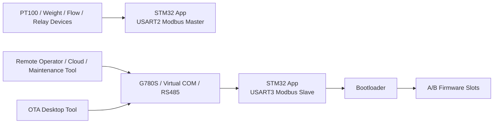

# STM32 Mill

English | [中文](README_CN.md)

This repository contains the current codebase for the STM32 Mill control and maintenance system. The active parts of the project are:

- `STM32/`: embedded firmware, bootloader, and Keil project
- `OTA/`: Windows desktop tool for local upgrade, remote upgrade, and remote maintenance

The `Windows/` folder is kept only as historical code. It is no longer planned for active maintenance.

## 3-Second Overview

**What this project is**

An industrial control and maintenance stack built around STM32 firmware plus a Windows OTA/maintenance tool.

**What problem it solves**

It brings field data acquisition, relay control, remote maintenance, and safer firmware upgrades into one practical workflow instead of splitting them across unrelated tools.

**Who it is for**

- Engineers maintaining STM32-based field equipment
- Developers building RS485 / Modbus industrial controllers
- Teams that need local and remote firmware upgrade capability with rollback awareness

## Overview

The system combines an STM32F103-based controller, field devices on RS485/Modbus, and a G780S communication path for maintenance and upgrade operations.

The current codebase covers three practical workflows:

- Field data acquisition and relay control
- Remote maintenance through Modbus registers exposed by the device
- A/B firmware upgrade with bootloader verification and rollback logic

## Features

- Field-side Modbus master polling for PT100, weight, flow, and relay devices
- Runtime relay control with local key handling and debounced DI processing
- G780S-facing Modbus slave for remote maintenance and diagnostics
- A/B slot firmware upgrade with bootloader-side integrity checks
- CRC32, SHA-256, vector-table validation, and fallback / rollback logic
- Desktop OTA tool for local upgrade, remote upgrade, and raw Modbus maintenance frames

## System Architecture



## Real-World Scenarios

- On-site commissioning: connect through RS485, verify sensor readings, drive relays, and load the correct firmware slot.
- Remote maintenance: expose Modbus registers through G780S, adjust runtime parameters, and inspect diagnostic state without opening the enclosure.
- Safer firmware rollout: upgrade the inactive slot first, verify the image in bootloader, then trial-boot with rollback protection.

## Project Status

Status: Active.

Current focus:

- Keep `STM32/` evolving as the production firmware path
- Keep `OTA/` improving as the primary maintenance and upgrade tool
- Keep `Windows/` available only as legacy reference

This repository is still moving forward. The current README is intentionally written around the code that is actively being used, not around the older historical layout.

## Roadmap

- Continue stabilizing A/B upgrade flow and diagnostics
- Improve OTA usability for field deployment and virtual-COM remote upgrade
- Expand engineering documentation and operator-facing examples
- Clean up packaging and release outputs under `Deploy/`
- Gradually retire the legacy `Windows/` path from the main workflow

## Hardware / Software Environment

### Hardware

- STM32F103ZE-based controller board
- RS485-connected field devices such as PT100, weighing, flowmeter, and relay modules
- G780S communication module or equivalent transparent transport path
- USB-to-RS485 adapter for local maintenance
- Optional virtual COM mapping software for remote upgrade workflows

### Software

- `Keil MDK-ARM` for embedded firmware builds
- `.NET SDK 10` for the OTA desktop application
- Windows 10/11 for the WPF toolchain
- Optional Modbus debugging tools for maintenance and validation

## License

There is currently no `LICENSE` file in the repository, so you should not assume open-source redistribution rights yet.

Recommended choices if you want to publish this project more formally:

- `Apache-2.0`: good default for a serious engineering project, especially if you want an explicit patent grant
- `MIT`: simpler and more permissive if you want the lowest adoption friction

If you want, the next step can be adding an actual `LICENSE` file rather than only documenting the recommendation here.

## Repository Focus

### `STM32/`

`STM32/` is the main embedded project. It includes:

- Application firmware for field data acquisition and relay control
- Bootloader for upgrade entry, image verification, and slot switching
- Shared upgrade state/control logic used by both App and Bootloader
- Keil MDK project with multiple build targets

Important implementation details from the current source:

- MCU: `STM32F103ZE`
- Main field bus: `USART2` as RS485 Modbus master
- Maintenance/upgrade bus: `USART3` as Modbus slave for G780S / remote tools
- Upgrade layout: A/B slots
- Slot A base: `0x08008000`
- Slot B base: `0x08043000`
- Bootloader area: `0x08000000` to `0x08007FFF`

Current application responsibilities include:

- Reading PT100 temperature data
- Reading weight data from the weighing module
- Measuring flow frequency and accumulated volume
- Driving relay outputs and debounced relay inputs
- Handling local key input in manual mode
- Exposing runtime, maintenance, and diagnostic registers through the G780S-facing Modbus slave

Current bootloader responsibilities include:

- Entering upgrade mode from the App
- Receiving images through YMODEM
- Writing to the inactive A/B slot
- Verifying image size, CRC32, SHA-256, and vector table validity
- Marking pending slots for trial boot
- Rolling back when verification or boot confirmation fails

### `OTA/`

`OTA/` is the current desktop-side toolchain. It is a .NET / WPF application, not the old Python-script-based workflow described by the previous README.

The solution is split into:

- `OTA.UI/`: WPF shell and views
- `OTA.ViewModels/`: page-level interaction logic
- `OTA.Core/`: upgrade coordination and maintenance services
- `OTA.Protocols/`: Modbus, running-slot detection, and YMODEM protocol helpers
- `OTA.Models/`: shared models and enums

The current OTA application provides three main pages:

- Local upgrade
- Remote upgrade through a virtual COM port
- Remote maintenance frame generation/import

Notable behavior in the current implementation:

- Local upgrade sends unlock and bootloader-entry commands, then performs YMODEM in C#
- Remote upgrade follows the same flow through a mapped virtual serial port
- The tool can read the current running slot from register `0x005A`
- The UI recommends `App_A.bin` or `App_B.bin` based on the running slot
- Remote maintenance can generate and correct raw Modbus RTU frames for direct use in external debugging or cloud tools

## Directory Layout

```text
STM32/
  Bootloader/   Bootloader sources
  BSP/          Board support and business modules
  Drivers/      HAL and CMSIS
  MDK-ARM/      Keil project and build outputs
  System/       Shared low-level modules
  User/         Application entry and runtime logic

OTA/
  OTA.Core/         Upgrade services and orchestration
  OTA.Models/       Shared models
  OTA.Protocols/    YMODEM / Modbus / slot-detection helpers
  OTA.UI/           WPF desktop app
  OTA.ViewModels/   UI state and commands

Deploy/       Installer and packaging assets
文档/         Reference documents and vendor materials
Windows/      Legacy desktop application, not maintained
```

## Build

### STM32 firmware

Open the Keil project:

- `STM32/MDK-ARM/Project.uvprojx`

The current project contains App and Bootloader targets, including `App_A` and `App_B`. The generated binaries are placed under:

- `STM32/MDK-ARM/Objects/`

Typical output files include:

- `App_A.bin`
- `App_B.bin`

### OTA desktop tool

Requirements:

- `.NET SDK 10`
- Windows with WPF support

Build command:

```powershell
dotnet build OTA\OTA.slnx -c Release -p:Platform=x64
```

The solution is configured to avoid parallel project builds because the repository currently relies on serialized MSBuild behavior for stable .NET 10 builds.

### Legacy Windows desktop app

The legacy Windows application still exists in:

- `Windows/Project.slnx`

It is no longer part of the actively maintained path and should be treated as reference or legacy code only.

## Documentation

Current top-level project documents:

- [Local upgrade guide](本地升级手册.md)
- [Remote maintenance command manual](远程维护指令手册.md)
- [Remote maintenance acceptance checklist](远程维护验收清单.md)

Useful OTA design / debugging notes:

- `OTA/ARCHITECTURE_REFACTOR_PLAN.md`
- `OTA/BOOTLOADER_MODE_OTA_BUG_ANALYSIS.md`

## Maintenance Status

Current priority:

- `STM32/`
- `OTA/`

Deprioritized / no longer planned for continued maintenance:

- `Windows/`

If you are new to the repository, start with `STM32/` for device behavior and `OTA/` for upgrade/maintenance tooling. The old README mentioned scripts and document names that no longer exist; this version reflects the current repository state instead.
