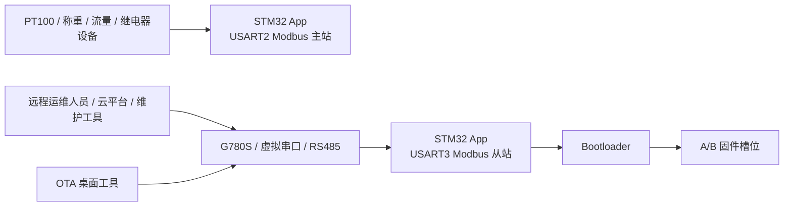

# STM32 Mill

[English](README.md) | 中文

这个仓库保存的是 STM32 Mill 控制与维护系统的当前代码。现在仍然作为主线维护的部分只有两个：

- `STM32/`：嵌入式固件、Bootloader、Keil 工程
- `OTA/`：Windows 桌面工具，负责本地升级、远程升级和远程维护

`Windows/` 目录目前仅作为历史代码保留，不再计划继续维护。

## 3 秒看懂

**这个项目是干什么的**

这是一个围绕 STM32 固件和 Windows OTA/维护工具构建的工业控制与维护方案。

**它解决什么问题**

它把现场采集、继电器控制、远程维护、固件升级这些原本分散的事情，收敛到一套可以真正落地的工程链路里。

**适合谁用**

- 维护 STM32 现场设备的工程师
- 开发 RS485 / Modbus 工业控制器的开发者
- 需要本地升级、远程升级和回退保护能力的团队

## 仓库概览

整个系统围绕 `STM32F103` 控制器、RS485/Modbus 现场设备，以及 `G780S` 通信链路展开，当前源码对应的实际能力主要有三条：

- 现场数据采集与继电器控制
- 通过设备寄存器进行远程维护
- 基于 A/B 槽位的固件升级、校验与回退

## Features

- 通过 Modbus 主站轮询 PT100、称重、流量和继电器设备
- 支持运行态继电器控制、本地按键控制和 DI 去抖处理
- 通过面向 G780S 的 Modbus 从站暴露远程维护和诊断信息
- 支持 A/B 槽位固件升级
- Bootloader 侧具备 CRC32、SHA-256、向量表校验与回退逻辑
- 提供桌面 OTA 工具，覆盖本地升级、远程升级和原始 Modbus 维护帧生成

## 系统架构图



## 真实应用场景

- 现场调试：工程师通过 RS485 接入设备，确认传感器数据、继电器输出和当前运行槽位。
- 远程维护：通过 G780S 暴露维护寄存器，在线调整参数、读取诊断状态，而不必拆机。
- 安全升级：先刷写非运行槽位，再由 Bootloader 做完整性校验和试运行确认，降低升级失败风险。

## 项目状态

状态：Active。

当前重点：

- 持续推进 `STM32/` 作为生产固件主线
- 持续完善 `OTA/` 作为主要维护和升级工具
- `Windows/` 仅保留历史参考，不再作为后续重点开发对象

这个仓库不是“归档状态”，而是还会继续迭代。现在这份 README 的定位，就是让第一次看到项目的人能立刻知道主线还在推进。

## Roadmap

- 持续增强 A/B 升级链路和故障诊断能力
- 改进 OTA 工具在现场部署和虚拟串口远程升级下的可用性
- 补充更多工程文档、操作说明和示例
- 继续整理 `Deploy/` 下的打包与发布产物
- 逐步把历史 `Windows/` 路径退出主工作流

## 硬件 / 软件环境

### 硬件环境

- 基于 `STM32F103ZE` 的控制板
- 通过 RS485 接入的 PT100、称重、流量计、继电器等现场设备
- `G780S` 通信模块或等效透传链路
- 本地维护用 USB 转 RS485 适配器
- 远程升级场景下可选的虚拟串口映射软件

### 软件环境

- `Keil MDK-ARM` 用于嵌入式固件构建
- `.NET SDK 10` 用于 OTA 桌面工具构建
- Windows 10/11 用于 WPF 工具链运行
- 可选 Modbus 调试工具用于联调和维护

## License

当前仓库采用 `Apache-2.0` 协议，见 [LICENSE](LICENSE)。

实际含义可以简单理解为：

- 可以商用
- 可以修改并再次分发
- 下游项目即使闭源也可以使用
- 协议本身带有相对明确的专利授权条款

在再分发时，需要保留许可证文本和相关声明。

## 当前主线

### `STM32/`

`STM32/` 是当前最核心的嵌入式工程，包含：

- 现场业务 App 固件
- 负责升级接管、镜像校验和槽位切换的 Bootloader
- App 与 Bootloader 共用的升级状态页和控制页逻辑
- Keil MDK 工程与构建输出

从当前源码可以确认的关键实现如下：

- MCU：`STM32F103ZE`
- 现场总线：`USART2` 作为 RS485 Modbus 主站
- 维护/升级总线：`USART3` 作为面向 G780S 的 Modbus 从站
- 升级架构：A/B 双槽位
- A 槽基址：`0x08008000`
- B 槽基址：`0x08043000`
- Bootloader 区：`0x08000000` 到 `0x08007FFF`

当前 App 侧职责包括：

- 采集 PT100 温度数据
- 采集称重模块数据
- 计算流量频率和累计量
- 控制继电器输出并处理带去抖的继电器输入
- 在手动模式下响应本地按键
- 通过面向 G780S 的 Modbus 从站暴露运行态、维护态和诊断寄存器

当前 Bootloader 侧职责包括：

- 接收 App 发起的升级进入请求
- 通过 YMODEM 接收镜像
- 将镜像写入非当前运行槽位
- 校验镜像大小、CRC32、SHA-256 和向量表合法性
- 标记待试运行槽位
- 在校验失败或试运行确认失败时执行回退

### `OTA/`

`OTA/` 是当前 PC 侧的主工具链。它已经不是旧 README 中描述的 Python 脚本组合，而是一个分层的 .NET / WPF 应用。

当前解决方案分为：

- `OTA.UI/`：WPF 壳层和页面
- `OTA.ViewModels/`：页面交互和状态管理
- `OTA.Core/`：升级协调与维护服务
- `OTA.Protocols/`：Modbus、运行槽位识别、YMODEM 协议辅助
- `OTA.Models/`：共享模型与枚举

当前 OTA 工具已经包含三个主要页面：

- 本地升级
- 远程升级（虚拟串口）
- 远程维护帧生成 / 导入

根据现有实现，当前 OTA 工具具备这些行为：

- 本地升级先发送解锁和进入 Bootloader 指令，再由 C# 内置 YMODEM 发包
- 远程升级通过映射出来的虚拟串口走同样的升级流程
- 可通过寄存器 `0x005A` 读取当前运行槽位
- 会根据当前运行槽位推荐 `App_A.bin` 或 `App_B.bin`
- 远程维护页可以生成、导入并纠正 Modbus RTU 原始帧，便于粘贴到外部调试或云平台工具

## 目录结构

```text
STM32/
  Bootloader/   Bootloader 源码
  BSP/          板级驱动与业务模块
  Drivers/      HAL 与 CMSIS
  MDK-ARM/      Keil 工程与编译输出
  System/       共用底层模块
  User/         App 入口与运行逻辑

OTA/
  OTA.Core/         升级服务与流程编排
  OTA.Models/       共享模型
  OTA.Protocols/    YMODEM / Modbus / 槽位识别辅助
  OTA.UI/           WPF 桌面程序
  OTA.ViewModels/   UI 状态与命令

Deploy/       安装包与发布资源
文档/         参考资料与第三方文档
Windows/      历史桌面程序，不再维护
```

## 构建方式

### STM32 固件

打开 Keil 工程：

- `STM32/MDK-ARM/Project.uvprojx`

当前工程中包含 App 和 Bootloader 相关 target，其中包括 `App_A`、`App_B`。构建产物位于：

- `STM32/MDK-ARM/Objects/`

常见输出文件包括：

- `App_A.bin`
- `App_B.bin`

### OTA 桌面工具

环境要求：

- `.NET SDK 10`
- 支持 WPF 的 Windows 环境

构建命令：

```powershell
dotnet build OTA\OTA.slnx -c Release -p:Platform=x64
```

当前仓库已经在 `Directory.Build.props` 中关闭了解决方案级并行构建，以规避 .NET 10 下该方案的并行解析问题。

### 历史 Windows 上位机

历史 Windows 程序仍然保留在：

- `Windows/Project.slnx`

但它已经不属于当前主维护路径，应视为历史参考代码，而不是后续开发重点。

## 文档

当前仓库顶层仍在使用的项目文档有：

- [本地升级手册](本地升级手册.md)
- [远程维护指令手册](远程维护指令手册.md)
- [远程维护验收清单](远程维护验收清单.md)

另外，`OTA/` 目录下还有两个很重要的设计/排障文档：

- `OTA/ARCHITECTURE_REFACTOR_PLAN.md`
- `OTA/BOOTLOADER_MODE_OTA_BUG_ANALYSIS.md`

## 维护状态

当前优先维护：

- `STM32/`
- `OTA/`

当前不再计划继续维护：

- `Windows/`

如果第一次接手这个仓库，建议优先阅读 `STM32/` 了解设备行为，再阅读 `OTA/` 了解升级与维护工具链。旧版 README 中提到的一些脚本、目录职责和文档名已经与仓库实际状态不一致，这个版本已经按当前代码重新整理。
